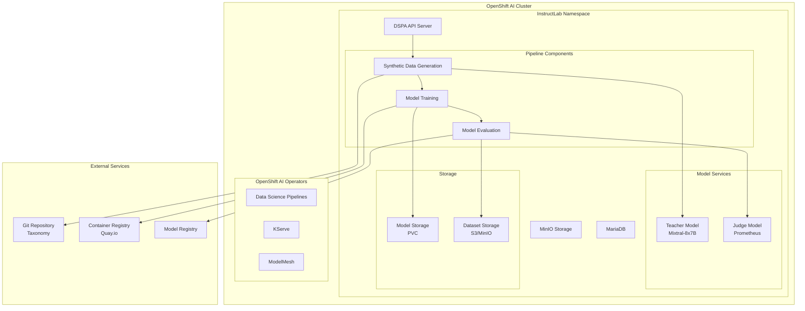

# InstructLab Pipeline on OpenShift AI

A complete implementation of the InstructLab synthetic data generation and model training pipeline on Red Hat OpenShift AI, featuring automated deployment, GPU acceleration support, and production-ready configurations.

## Table of Contents
- [Overview](#overview)
- [Architecture](#architecture)
- [Requirements](#requirements)
- [GPU Configuration](#gpu-configuration)
- [How to Install](#how-to-install)
- [Project Structure](#project-structure)
- [Usage](#usage)
- [Monitoring and Troubleshooting](#monitoring-and-troubleshooting)
- [Contributing](#contributing)

## Overview

This project provides a complete, production-ready deployment of the InstructLab pipeline on Red Hat OpenShift AI. InstructLab enables automated fine-tuning of Large Language Models (LLMs) through:

- **Synthetic Data Generation (SDG)**: Creates training data from taxonomy repositories
- **Model Training**: Multi-phase fine-tuning with configurable parameters
- **Model Evaluation**: Automated quality assessment using judge models
- **Model Registry Integration**: Seamless model versioning and deployment

### Key Features

- 🚀 **One-Click Deployment**: Automated DSPA setup with validation
- 🔧 **GPU Acceleration**: Optimized for NVIDIA GPU workloads
- 🛡️ **Production Security**: Proper RBAC, secrets management, and network policies  
- 📊 **Comprehensive Monitoring**: Pipeline observability and resource tracking
- 🏗️ **Infrastructure as Code**: Reproducible deployments across clusters
- 📚 **Complete Documentation**: Step-by-step guides and troubleshooting

## Architecture



## Requirements

### OpenShift Cluster Requirements

| Component | Version | Notes |
|-----------|---------|-------|
| **OpenShift** | 4.14+ | Container platform |
| **OpenShift AI** | 2.8+ | AI/ML operators and services |
| **Cluster CPU** | 32+ cores | For pipeline workloads |
| **Cluster Memory** | 128GB+ | For model training |
| **Storage** | 500GB+ | For models and datasets |
| **GPU Nodes** | Optional | Recommended for training |

### Required Operators

These operators must be installed via the OpenShift Console or CLI:

- **Red Hat OpenShift AI** - Core AI platform
- **Data Science Pipelines** - Kubeflow Pipelines v2
- **OpenShift Serverless** - For KServe model serving
- **GPU Operator** (if using GPUs) - NVIDIA GPU support

### Client Tools

| Tool | Version | Purpose |
|------|---------|---------|
| **oc CLI** | 4.14+ | OpenShift command line |
| **Python** | 3.8+ | Pipeline submission scripts |
| **Git** | 2.30+ | Repository access |
| **curl** | Latest | API testing |

### External Services

- **Git Repository**: For taxonomy data (GitHub, GitLab, etc.)
- **Container Registry**: For model images (Quay.io, Docker Hub, etc.)  
- **Model Registry**: For model versioning (optional)

## GPU Configuration

### Recommended GPU Setup

For optimal performance, configure GPU nodes with:

| Specification | Recommendation | Notes |
|--------------|----------------|-------|
| **GPU Type** | NVIDIA A100, V100, or T4 | A100 preferred for large models |
| **GPU Memory** | 40GB+ per GPU | For 7B+ parameter models |
| **GPU Count** | 2-8 GPUs per node | Enables model parallelism |
| **Node Memory** | 256GB+ | Supports GPU memory requirements |
| **Storage** | NVMe SSD | Fast model loading |

### GPU Node Configuration

1. **Label GPU Nodes**:
   ```bash
   oc label node <gpu-node-name> accelerator=nvidia-gpu
   oc label node <gpu-node-name> node-type=gpu-enabled
   ```

2. **Install NVIDIA GPU Operator**:
   ```bash
   # Via OpenShift Console: Operators → OperatorHub → NVIDIA GPU Operator
   # Or via CLI:
   oc create namespace nvidia-gpu-operator
   oc apply -f https://raw.githubusercontent.com/NVIDIA/gpu-operator/master/deployments/gpu-operator.yaml
   ```

3. **Verify GPU Detection**:
   ```bash
   oc describe node <gpu-node-name> | grep nvidia.com/gpu
   ```

### Pipeline GPU Configuration

Configure GPU usage in pipeline parameters:

```yaml
# Example GPU configuration
train_node_selectors:
  accelerator: "nvidia-gpu"
  node-type: "gpu-enabled"

train_tolerations:
  - key: "nvidia.com/gpu"
    operator: "Exists"
    effect: "NoSchedule"

train_resources:
  limits:
    nvidia.com/gpu: "2"  # Request 2 GPUs
    memory: "64Gi"
    cpu: "16"
```

## How to Install

### Step 1: Check Prerequisites

1. **Run Environment Check**:
   ```bash
   # Clone the repository first
   git clone <this-repository-url>
   cd hello-chris-dev-taxonomy
   
   # Run prerequisite validation
   ./check-environment.sh
   ```

### Step 2: Prepare OpenShift Cluster

1. **Install Required Operators** (if not already installed):
   ```bash
   # Log into OpenShift
   oc login --server=https://your-cluster-api:6443
   
   # Install OpenShift AI (via Console or CLI)
   # Navigate to: Operators → OperatorHub → Red Hat OpenShift AI
   ```

2. **Verify Operator Installation**:
   ```bash
   oc get csv -n redhat-ods-operator
   oc get pods -n redhat-ods-applications
   ```

### Step 3: Clone and Configure Project

1. **Clone Repository**:
```bash
git clone <this-repository-url>
cd hello-chris-dev-taxonomy
```

2. **Extract Deployment Package**:
```bash
cd dspa-deployment
# Or if using a packaged release:
# tar -xzf dspa-instructlab-deployment-*.tar.gz
# cd dspa-instructlab-deployment-*
```

3. **Create Kubernetes Secrets (do NOT commit secrets to Git)**:

Kubernetes Secrets must be created out-of-band. Use your own credentials; never hard-code them in manifests.

- Taxonomy repository access (for private repos):
```bash
oc create secret generic taxonomy-repo-secret \
  --from-literal=username="<your-git-username>" \
  --from-literal=password="<your-git-token-or-password>" \
  -n petloan-instructlab --dry-run=client -o yaml | oc apply -f -
```

- S3/MinIO credentials (referenced as s3-credentials):
```bash
oc create secret generic s3-credentials \
  --from-literal=AWS_ACCESS_KEY_ID="<your-access-key-id>" \
  --from-literal=AWS_SECRET_ACCESS_KEY="<your-secret-access-key>" \
  --from-literal=AWS_DEFAULT_REGION="<your-region>" \
  -n petloan-instructlab --dry-run=client -o yaml | oc apply -f -
```

- Container registry push secret (for build/push steps):
```bash
oc create secret generic oci-output-push-secret \
  --from-file=.dockerconfigjson="${HOME}/.docker/config.json" \
  --type=kubernetes.io/dockerconfigjson \
  -n petloan-instructlab --dry-run=client -o yaml | oc apply -f -
```

4. **Configure Secret Templates (optional, templates only)**:
```bash
# Edit the secrets template (contains placeholders only)
vim 03-secrets.yaml

# Update placeholders if you plan to apply templates in a non-production environment.
# Prefer creating secrets via 'oc create secret' as shown above.
```

### Step 4: Deploy DSPA Infrastructure

1. **Run Automated Deployment**:
   ```bash
   # Make scripts executable
   chmod +x *.sh *.py
   
   # Deploy all resources
   ./deploy.sh
   ```

2. **Validate Deployment**:
   ```bash
   # Run comprehensive validation
   ./validate.sh
   
   # Check individual components
   oc get pods -n petloan-instructlab
   oc describe dspa dspa -n petloan-instructlab
   ```

### Step 5: Deploy Model Services (Optional)

If you need local model endpoints:

1. **Deploy Teacher Model**:
   ```bash
   # From project root directory
   oc apply -f examples/model-deployments/teacher-model-deployment.yaml
   oc apply -f examples/model-deployments/judge-model-deployment.yaml
   ```

2. **Verify Model Services**:
   ```bash
   oc get pods | grep -E "(mixtral|prometheus)"
   oc get svc | grep -E "(teacher|judge)"
   ```

### Step 6: Submit Test Pipeline

1. **Start Port Forwarding**:
   ```bash
   # In a separate terminal
   oc port-forward -n petloan-instructlab svc/ds-pipeline-dspa 8888:8888
   ```

2. **Submit Pipeline Run**:
   ```bash
   # Install Python dependencies
   pip install -r dspa-deployment/requirements.txt
   
   # Submit with default working configuration
   python3 dspa-deployment/submit_pipeline.py
   
   # Or submit with custom parameters
   python3 dspa-deployment/submit_pipeline.py \
       --repo-url "https://github.com/your-org/taxonomy.git" \
       --base-model "microsoft/DialoGPT-medium" \
       --output-model-name "my-fine-tuned-model"
   ```

3. **Monitor Pipeline**:
   ```bash
   # Watch pipeline pods
   oc get pods -n petloan-instructlab -w | grep instructlab
   
   # View pipeline logs
   oc logs -f <pipeline-pod-name> -n petloan-instructlab
   ```

## Project Structure

```
hello-chris-dev-taxonomy/
├── README.md                          # This file
├── check-environment.sh               # Prerequisites validation script
├── dspa-deployment/                   # DSPA deployment package (MAIN)
│   ├── 01-dspa.yaml                  # DSPA configuration
│   ├── 02-service-account.yaml       # Service account and RBAC
│   ├── 03-secrets.yaml               # Secret templates
│   ├── deploy.sh                     # Automated deployment
│   ├── submit_pipeline.py            # Pipeline submission
│   ├── validate.sh                   # Deployment validation
│   ├── package.sh                    # Create deployment tarball
│   └── README.md                     # Detailed deployment guide
├── examples/                         # Optional example configurations
│   ├── model-deployments/           # KServe model serving examples
│   └── README.md                    # Examples documentation
├── ilab-on-ocp/                      # InstructLab pipeline source code
│   ├── pipeline.yaml                # Kubeflow pipeline YAML
│   ├── manifests/                   # Pipeline component manifests
│   └── [pipeline components]        # SDG, training, evaluation code
├── openshift-manifests/              # Legacy OpenShift resources
│   ├── model-serving/               # Model deployment configurations
│   ├── training-pipelines/          # Training job examples
│   └── operators/                   # Operator configurations
└── taxonomy/                         # Sample taxonomy data
```

## Usage

### Basic Pipeline Submission

```bash
# Simple submission with defaults
python3 dspa-deployment/submit_pipeline.py

# With custom parameters
python3 dspa-deployment/submit_pipeline.py \
    --repo-url "https://github.com/instructlab/taxonomy.git" \
    --base-model "registry.redhat.io/rhelai1/granite-7b-starter" \
    --output-model-name "fine-tuned-granite-7b"
```

### Advanced Configuration

```bash
# GPU-enabled training with custom resources
python3 dspa-deployment/submit_pipeline.py \
    --repo-url "https://github.com/your-org/taxonomy.git" \
    --base-model "registry.redhat.io/rhelai1/granite-7b-starter" \
    --output-model-name "gpu-trained-model" \
    # Additional parameters can be set in the script
```

### Monitoring Pipeline Runs

```bash
# List all pipeline runs
oc get pods -n petloan-instructlab | grep instructlab

# Follow specific pipeline logs
oc logs -f <pod-name> -n petloan-instructlab

# Monitor resource usage
oc top pods -n petloan-instructlab

# Access DSPA UI (via route)
oc get routes -n petloan-instructlab
```

## Monitoring and Troubleshooting

### Common Issues and Solutions

#### 1. DSPA Components Not Starting
```bash
# Check DSPA status
oc describe dspa dspa -n petloan-instructlab

# Common fixes:
# - Verify OpenShift AI operators are running
# - Check resource quotas and limits
# - Ensure proper RBAC permissions
```

#### 2. Pipeline Submission Failures
```bash
# Check authentication
oc whoami -t

# Verify API connectivity
curl -k https://localhost:8888/apis/v2beta1/pipelines \
  -H "Authorization: Bearer $(oc whoami -t)"
```

#### 3. GPU Not Available
```bash
# Check GPU operator
oc get pods -n nvidia-gpu-operator

# Verify GPU detection
oc describe node <gpu-node> | grep nvidia.com/gpu

# Check node labels
oc get nodes --show-labels | grep accelerator
```

### Performance Tuning

- **Increase PVC sizes** for large models and datasets
- **Configure GPU resource requests** based on model size
- **Adjust batch sizes** and learning rates for optimal training
- **Use node selectors** to target appropriate hardware

### Logging and Observability

- **Pipeline Logs**: Available through OpenShift Console or CLI
- **Resource Metrics**: Monitor CPU, memory, and GPU utilization
- **Storage Usage**: Track PVC usage for models and datasets
- **Network Traffic**: Monitor ingress/egress for model downloads

## Contributing

We welcome contributions! Please see our contributing guidelines:

1. **Fork the repository** and create a feature branch
2. **Test your changes** on a real OpenShift AI cluster  
3. **Update documentation** for any new features
4. **Submit a pull request** with a clear description

### Development Setup

```bash
# Clone for development
git clone <repository-url>
cd hello-chris-dev-taxonomy

# Install development dependencies
pip install -r dspa-deployment/requirements.txt

# Run validation tests
cd dspa-deployment && ./validate.sh
```

## License

This project is licensed under the Apache License 2.0 - see the [LICENSE](LICENSE) file for details.

## Support

### Documentation
- 📚 **Detailed Deployment**: See `dspa-deployment/README.md` for comprehensive setup guide
- ⚡ **Quick Start**: See `QUICKSTART.md` for rapid deployment (30 minutes)
- 🔧 **Troubleshooting**: See `dspa-deployment/TROUBLESHOOTING.md` for common issues
- 🎯 **Success Examples**: See `dspa-deployment/PIPELINE_SUCCESS_SUMMARY.md` for proven results

### Support Channels
- **Issues**: Report bugs and feature requests via GitHub issues  
- **Community**: Join the InstructLab community discussions
- **Red Hat Support**: For OpenShift AI support, contact Red Hat
- **Documentation**: All guides include real deployment experience and solutions

---

**Quick Start**: Ready to deploy? Jump to [QUICKSTART.md](QUICKSTART.md) for 30-minute setup or [How to Install](#how-to-install) for detailed instructions!
